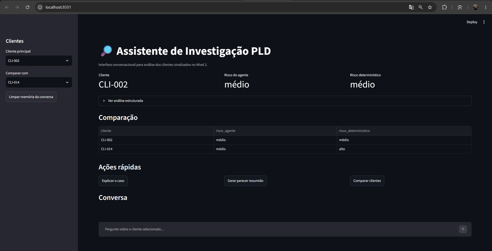
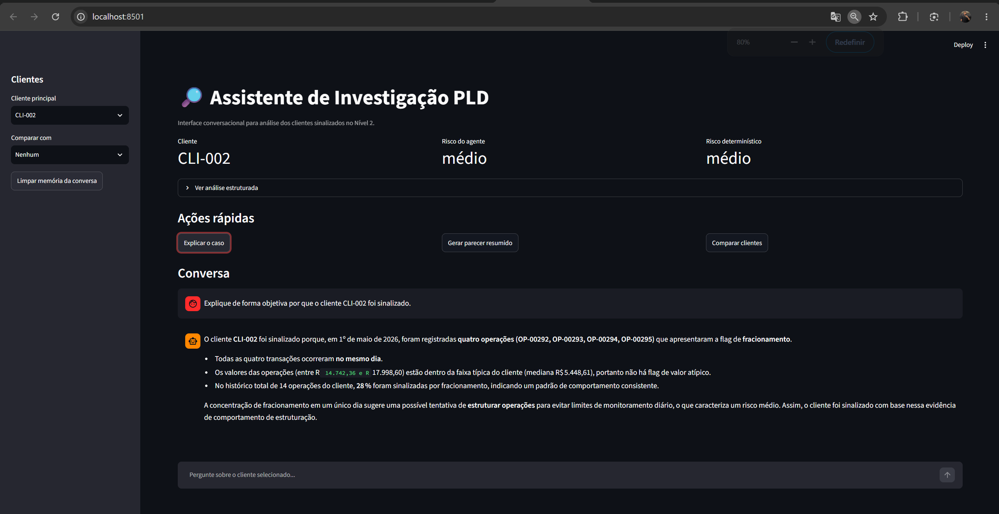
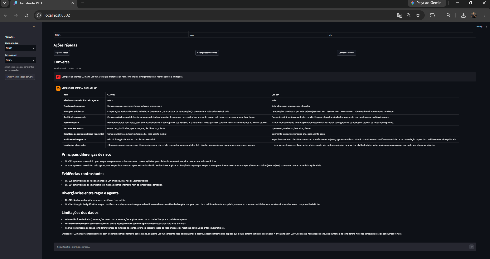

# Desafio Técnico — Engenharia de Inteligência Artificial

Solução desenvolvida para o desafio técnico de estágio em Engenharia de Inteligência Artificial.

O projeto simula um cenário de Prevenção à Lavagem de Dinheiro (PLD), combinando:

- tratamento de dados com Python e pandas;
- regras determinísticas;
- análise com modelo de linguagem;
- agente com seleção dinâmica de ferramentas;
- processamento em lote;
- confronto entre regras e agente;
- interface conversacional para apoio à análise humana.

Todos os dados utilizados são fictícios e foram fornecidos exclusivamente para o desafio.

---

## Status da entrega

| Etapa | Status |
|---|---|
| Nível 1 — Dados, regras e LLM | ✅ Completo |
| Nível 2 — Agente e execução em escala | ✅ Completo |
| Confronto regras x agente | ✅ Completo |
| Nível 3 — Trilha C / Interface Conversacional | ✅ Completo |
| Documentação e outputs | ✅ Completo |

---

## Estrutura do projeto

```text
.
├── dados/
│   ├── dados_nivel_1.json
│   └── dados_nivel_2.json
│
├── docs/
│   ├── DECISOES.md
│   └── USO_DE_IA.md
│
├── nivel_1/
│   └── nivel_1.ipynb
│
├── nivel_2/
│   ├── agente.py
│   ├── confronto.py
│   ├── nivel_2.ipynb
│   └── tools.py
│
├── nivel_3/
│   └── app.py
│
├── outputs/
│   ├── lote_clientes.csv
│   ├── lote_clientes.json
│   ├── metricas_execucao.csv
│   ├── confronto.csv
│   ├── confronto_resumo.json
│   ├── interface_principal.png
│   ├── interface_memoria.png
│   └── interface_comparacao.png
│
├── .env.example
├── .gitignore
├── ENTREGA.yaml
├── README.md
└── requirements.txt
```

---

## Tecnologias utilizadas

- Python
- pandas
- Jupyter Notebook
- Groq API
- `openai/gpt-oss-20b`
- Pydantic
- Streamlit
- Git / GitHub

---

# Configuração

## 1. Criar o ambiente virtual

No Windows:

```powershell
python -m venv .venv
```

Ative:

```powershell
.\.venv\Scripts\Activate.ps1
```

Caso o PowerShell bloqueie a execução:

```powershell
Set-ExecutionPolicy -Scope Process -ExecutionPolicy RemoteSigned
```

Depois execute novamente:

```powershell
.\.venv\Scripts\Activate.ps1
```

---

## 2. Instalar as dependências

```powershell
python -m pip install -r requirements.txt
```

---

## 3. Configurar a API

Crie um arquivo `.env` na raiz do projeto com base em:

```text
.env.example
```

Configure:

```env
GROQ_API_KEY=sua_chave_aqui
```

A chave real não deve ser adicionada ao Git.

---

# Nível 1 — Dados, regras e primeira análise com LLM

O Nível 1 está implementado em:

```text
nivel_1/nivel_1.ipynb
```

O notebook contém as principais etapas já executadas.

## Tratamento dos dados

Foram tratados:

- registros duplicados;
- datas ausentes;
- operações em BRL e USD.

Duplicidades foram removidas utilizando o identificador da operação.

Datas ausentes foram preservadas como valores nulos, permitindo que as operações ainda sejam utilizadas em análises que não dependam de data.

Valores em USD foram convertidos para BRL utilizando exclusivamente a taxa de câmbio fornecida nos dados.

---

## Regra 1 — Fracionamento

Um cliente é sinalizado quando, na mesma data:

- possui 3 ou mais operações;
- o total ultrapassa R$ 50.000;
- cada operação individual é inferior a R$ 20.000.

A regra foi validada com casos positivos e negativos conhecidos na base.

---

## Regra 2 — Valor atípico

Uma operação é considerada atípica quando:

```text
valor da operação > 5 × mediana do cliente
```

A regra é aplicada somente a clientes com pelo menos quatro operações.

---

## Análise qualitativa com LLM

Um cliente sinalizado foi enviado ao modelo apenas após os cálculos determinísticos já estarem concluídos.

A resposta foi validada estruturalmente com Pydantic e contém:

- nível de risco;
- tipologia suspeita;
- red flags;
- justificativa.

Também foram comparadas duas estratégias de prompt.

A versão com restrições mais explícitas apresentou maior controle sobre inferências e foi utilizada como referência para a construção do agente do Nível 2.

---

# Nível 2 — Escala e agente

O Nível 2 utiliza:

```text
dados/dados_nivel_2.json
```

As mesmas regras determinísticas do Nível 1 foram reaplicadas à base maior.

Os 10 clientes mais priorizados foram escolhidos utilizando:

1. quantidade de sinalizações;
2. volume total como critério de desempate.

Para o ranking, cada operação marcada é considerada uma sinalização.

No confronto de risco, operações de fracionamento pertencentes ao mesmo cliente e à mesma data são consolidadas como um único evento.

---

## Ferramentas do agente

As ferramentas estão implementadas em:

```text
nivel_2/tools.py
```

O agente pode utilizar:

### `historico_cliente`

Retorna informações agregadas do histórico do cliente.

### `operacoes_do_dia`

Retorna as operações de um cliente em uma data específica.

### `perfil_canal`

Apresenta a distribuição das operações por canal.

### `operacoes_sinalizadas`

Retorna somente as operações que acionaram alguma regra determinística.

O agente escolhe dinamicamente quais ferramentas consultar.

Nem todas as ferramentas são executadas para todos os clientes.

---

## Agente de investigação

Implementação:

```text
nivel_2/agente.py
```

Modelo utilizado:

```text
openai/gpt-oss-20b
```

Provedor:

```text
Groq
```

Fluxo simplificado:

```text
Cliente priorizado
       ↓
Agente
       ↓
Escolha dinâmica de ferramentas
       ↓
Consulta às evidências
       ↓
Parecer estruturado
```

O agente foi instruído a:

- utilizar apenas informações disponíveis;
- tratar flags como sinais de triagem;
- não considerar sinalização como comprovação de ilícito;
- evitar inventar contexto;
- não refazer cálculos já fornecidos pelas ferramentas;
- produzir recomendações proporcionais;
- manter a decisão final sujeita à análise humana.

---

# Execução do lote

O agente foi executado sobre os 10 clientes priorizados.

Foram registradas métricas por chamada e por cliente:

- tokens de entrada;
- tokens de saída;
- tokens totais;
- latência;
- custo estimado;
- ferramentas utilizadas;
- número de chamadas ao LLM.

## Resultado final

| Métrica | Resultado |
|---|---:|
| Clientes processados | 10 |
| Respostas válidas | 10 |
| Chamadas ao LLM | 36 |
| Tokens de entrada | 48.128 |
| Tokens de saída | 8.067 |
| Tokens totais | 56.195 |
| Média de tokens por chamada | 1.560,97 |
| Média de tokens por cliente | 5.619,50 |
| Latência total das chamadas | 261,10 s |
| Latência média por chamada | 7,25 s |
| Latência média por cliente | 26,11 s |
| Custo estimado total | US$ 0,006030 |
| Custo estimado médio por cliente | US$ 0,000603 |

Durante a execução ocorreram limites temporários da API.

Foi implementado tratamento de rate limit com novas tentativas e espera antes de repetir a chamada.

Os resultados estão disponíveis em:

```text
outputs/lote_clientes.csv
outputs/lote_clientes.json
outputs/metricas_execucao.csv
```

---

# Confronto entre regras e agente

Implementação:

```text
nivel_2/confronto.py
```

Foi criado um critério determinístico de risco apenas para permitir a comparação solicitada no desafio:

- **baixo:** nenhum evento determinístico;
- **médio:** um evento determinístico;
- **alto:** dois ou mais eventos ou ocorrência das duas tipologias.

Esse critério é de triagem e não representa uma metodologia real de PLD.

## Resultado

| Métrica | Resultado |
|---|---:|
| Clientes comparados | 10 |
| Concordâncias | 4 |
| Divergências | 6 |
| Taxa de concordância | 40% |

Os quatro clientes com eventos de fracionamento receberam risco médio tanto pelas regras quanto pelo agente.

As seis divergências ocorreram em clientes com múltiplas operações de valor atípico.

A análise foi realizada caso a caso. Em algumas situações o agente apresentou uma priorização mais proporcional; em outras, tanto a classificação determinística quanto a do agente foram consideradas extremas.

Também foi identificada uma situação em que a classificação do agente parecia razoável, mas sua justificativa introduziu uma inferência mais forte do que os dados permitiam.

Isso reforça que o LLM é utilizado como apoio ao analista e não como decisão automática.

Resultados:

```text
outputs/confronto.csv
outputs/confronto_resumo.json
```

---

# Nível 3 — Trilha C: Interface Conversacional

Foi escolhida a:

**Trilha C — Interface Conversacional**

A aplicação foi construída com Streamlit:

```text
nivel_3/app.py
```

A interface permite:

- selecionar um cliente;
- visualizar risco do agente;
- visualizar risco determinístico;
- consultar a análise estruturada;
- pedir explicações sobre o caso;
- gerar um parecer resumido;
- comparar clientes;
- realizar perguntas adicionais;
- manter memória da conversa durante a sessão.

A memória é separada por contexto da análise.

Dessa forma, uma conversa realizada sobre um cliente não é enviada automaticamente ao modelo quando o analista muda para outro caso.

Também existe memória própria para contextos de comparação entre clientes.

---

## Executando a interface

Na raiz do projeto:

```powershell
python -m streamlit run nivel_3/app.py
```

O Streamlit normalmente ficará disponível em:

```text
http://localhost:8501
```

---

# Prints da interface

## Tela principal



## Memória da conversa



## Comparação entre clientes



---

# Documentação

## Decisões técnicas

Trade-offs, limitações e possíveis evoluções:

```text
docs/DECISOES.md
```

Entre os principais temas estão:

- separação entre regras e interpretação do LLM;
- seleção dinâmica de ferramentas;
- controle de inferências;
- rate limit;
- confronto entre regras e agente;
- memória da interface;
- limitações da solução;
- possíveis evoluções.

---

## Uso de Inteligência Artificial

O uso de IA como apoio durante o desenvolvimento está documentado em:

```text
docs/USO_DE_IA.md
```

O documento registra:

- em quais etapas a IA auxiliou;
- como as sugestões foram validadas;
- situações em que sugestões precisaram ser corrigidas.

---

# Limitações

Esta solução utiliza dados fictícios e possui caráter experimental.

Ela não representa um sistema real de decisão de PLD.

Entre as principais limitações estão:

- base de dados pequena;
- ausência de contexto cadastral completo;
- ausência de histórico de longo prazo;
- ausência de integrações bancárias reais;
- ausência de autenticação e autorização;
- memória não persistente entre sessões;
- dependência de API externa;
- possíveis variações nas respostas do LLM.

As classificações devem ser interpretadas como apoio à triagem e revisão humana.

Para uma discussão mais detalhada dos trade-offs e limitações, consulte:

```text
docs/DECISOES.md
```

---

# Entregáveis principais

```text
ENTREGA.yaml

nivel_1/nivel_1.ipynb

nivel_2/nivel_2.ipynb
nivel_2/tools.py
nivel_2/agente.py
nivel_2/confronto.py

nivel_3/app.py

outputs/lote_clientes.csv
outputs/lote_clientes.json
outputs/metricas_execucao.csv
outputs/confronto.csv
outputs/confronto_resumo.json

outputs/interface_principal.png
outputs/interface_memoria.png
outputs/interface_comparacao.png

docs/DECISOES.md
docs/USO_DE_IA.md
```

---

# Conclusão

O principal aprendizado deste desafio foi perceber que as regras e o LLM têm
papéis diferentes.

As regras foram úteis para produzir uma triagem objetiva e reproduzível, mas o
confronto mostrou que simplesmente acumular sinalizações pode elevar demais o
risco de alguns clientes.

O agente ajudou a adicionar contexto a esses casos, mas também mostrou uma
limitação importante: no caso `CLI-013`, por exemplo, a classificação pareceu
razoável, enquanto parte da justificativa foi além do que os dados permitiam
afirmar.

Por isso, mantive os cálculos e limites no pandas e utilizei o LLM somente como
uma camada de interpretação. Para este tipo de problema, eu não trataria a saída
do modelo como decisão final sem revisão humana.